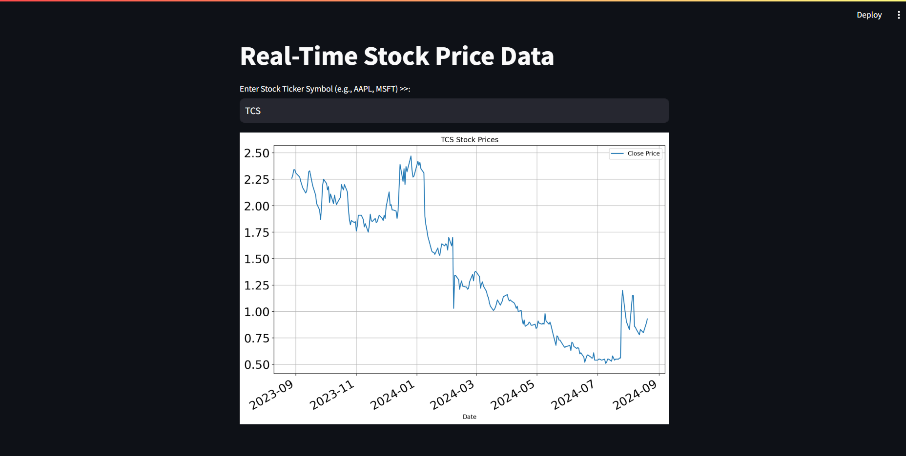

# Real-time Stock Price Data Visualization

This project is a web application that allows users to visualize real-time stock price data. Built using Python, the application leverages the `Streamlit` library for the interactive user interface and `yfinance` for fetching stock data from Yahoo Finance. The stock prices are displayed using `matplotlib`.

## Features

- **Real-time Data**: Fetch and display the latest stock prices.
- **Interactive UI**: Simple and user-friendly interface where users can enter a stock ticker symbol (e.g., AAPL, MSFT).
- **Visualization**: Stock prices are plotted using `matplotlib` for easy analysis.

## Installation

### Prerequisites

- Python 3.x
- `yfinance` library
- `streamlit` library
- `matplotlib` library

### Step-by-Step Guide

1. **Clone the repository:**

   ```bash
   git clone https://github.com/your-username/real-time-stock-price-visualization.git
   cd real-time-stock-price-visualization
2. **Install the required libraries:**

   ```bash
   pip install yfinance streamlit matplotlib
3. **Run the application:**

   ```bash
   streamlit run main.py
4. **Open the app:**
   - After running the above command, a local URL will be provided in the terminal.
   - Open this URL in your web browser to interact with the application.

## Usage

- Enter a valid stock ticker symbol (e.g., AAPL for Apple, MSFT for Microsoft) in the text input field.
- The app will fetch and display the closing prices of the stock for the past year in a line chart.

## Example

Here's a quick example of what the app looks like:



## License

This project is licensed under the MIT License - see the [LICENSE](LICENSE) file for details.

